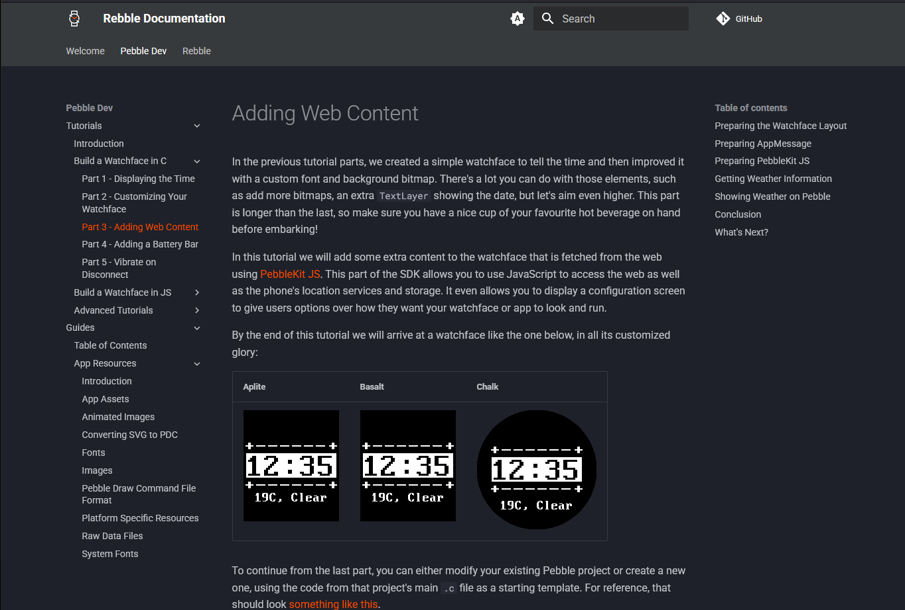

# rebble-docs



Experimental new static site builder for Pebble documentation using MkDocs with
the Material theme and custom styling.

Check the [mkdocs.yml](./mkdocs.yml) file for the site MkDocs configuration.

> For demo purposes, only the two main tutorials and the App Resources guides
> sections have been adapted to this site. Hopefully more will come!
>
> The `to-be-imported` directory contains guides and images that have yet to
> be imported and fixed up as described in
> [Migrating Pebble devsite](#migrating-pebble-devsite).

- [Setup](#setup)
- [Goals](#goals)
- [Resources](#resources)
- [Migrating Pebble devsite](#migrating-pebble-devsite)
- [Building Firmware Docs](#building-firmware-docs)

## Setup

Install dependencies:

```
pip install mkdocs mkdocs-material mdformat mkdoxy
```

Setup the project, including installing Git hooks for formatting:

```
./scripts/setup.sh
```

Serve locally or build the site:

```
mkdocs [serve|build]
```

> MkDocs will show logs alerting of missing links / pages / config values etc,
> so pay attention to it!

Run the formatter:

```
./scripts/format.sh [check|apply]
```

## Goals

- [x] Lightweight requirements
- [x] Easy to contribute
- [x] Instant reload
- [x] Decent search
- [x] Decent code syntax highlighting
- [x] Appropriate license (same as original devsite)
- [x] Markdown formatter
- [x] Usable completely offline
- [x] Import Tutorials section
- [ ] Import Pebble guides
- [ ] Import example apps page
- [ ] Import Pebble C / JS documentation
- [ ] Build and test formatting with GitHub actions
- [ ] Contributing guide

## Resources

Here are some resources to learn about how to build and modify this site.

- [MkDocs](https://www.mkdocs.org/)
- [MkDocs Material](https://squidfunk.github.io/mkdocs-material/setup/)
- [MkDocs Plugins](https://github.com/mkdocs/catalog)
- [mdformat](https://github.com/hukkin/mdformat)

## Migrating Pebble devsite

In migrating Markdown docs from the Pebble devsite
[repo](https://github.com/google/pebble), the following changes should be made:

- Remove all YAML frontmatter in `---` section.
- Move Google copyright notice to HTML comment (`<!-- ... -->`).
- Add the title of the page as a level 1 header (`#`).
- Run formatter.
- Remove SDK/CloudPebble specific Jekyll tags, keeping only SDK instructions (for now?).
- Remove `^LC^` and `^CP^` magic.
- Remove other `` magic stuff.
- Remove `class="platform-specific"` divs.
- Check links to other headings on the page work, and that code snippet languages are correct.
- Convert HTML tables and images to Markdown ones (also removing any image label magic).
- Image sizing use the `attr_list` syntax - see existing examples

## Building Firmware Docs

The `mkdoxy` plugin generates Markdown pages for inclusion in the `nav`.
Currently when configured as in `mkdocs.yml` it outputs 700+ files for `applib`,
which is a superset of what is offered in the SDK. Some pages like 'Groups'
seem more useful than the ones that just list every single file.

1. Copy `pebble-dev/pebble-firmware` to this project.
1. Check configuration
1. Run a build or serve.
1. `ls -la .mkdoxy/sdk/sdk/*md` for a list of all files as nav candidates.

Some refinement is needed to show only relevant pages.
