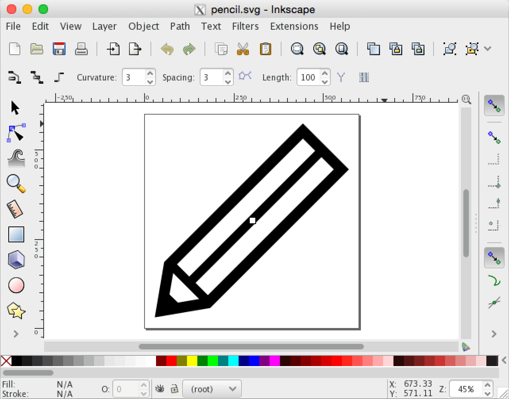
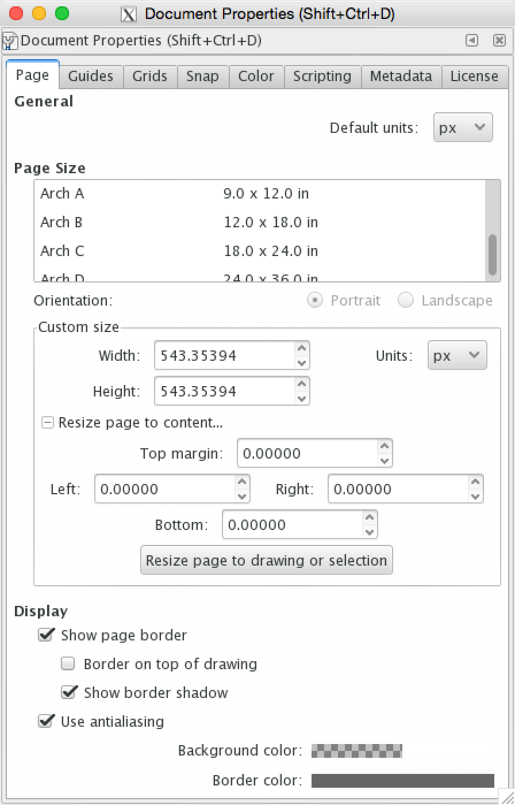
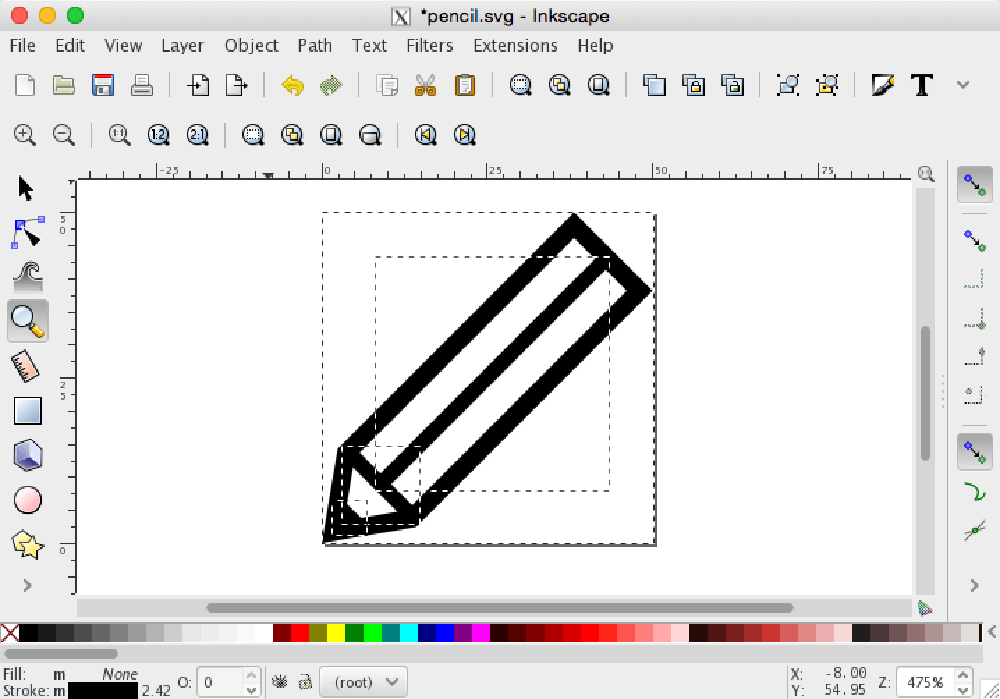
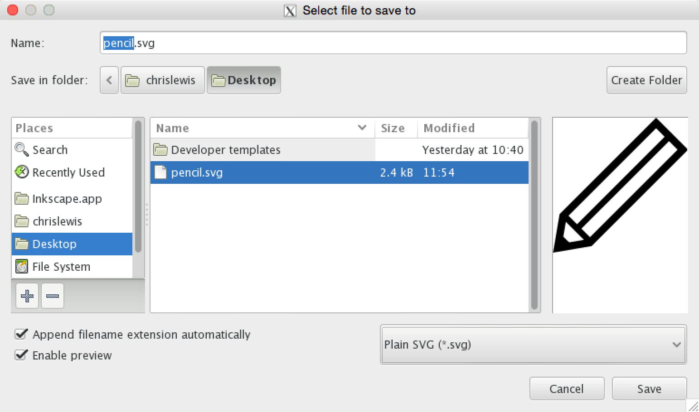
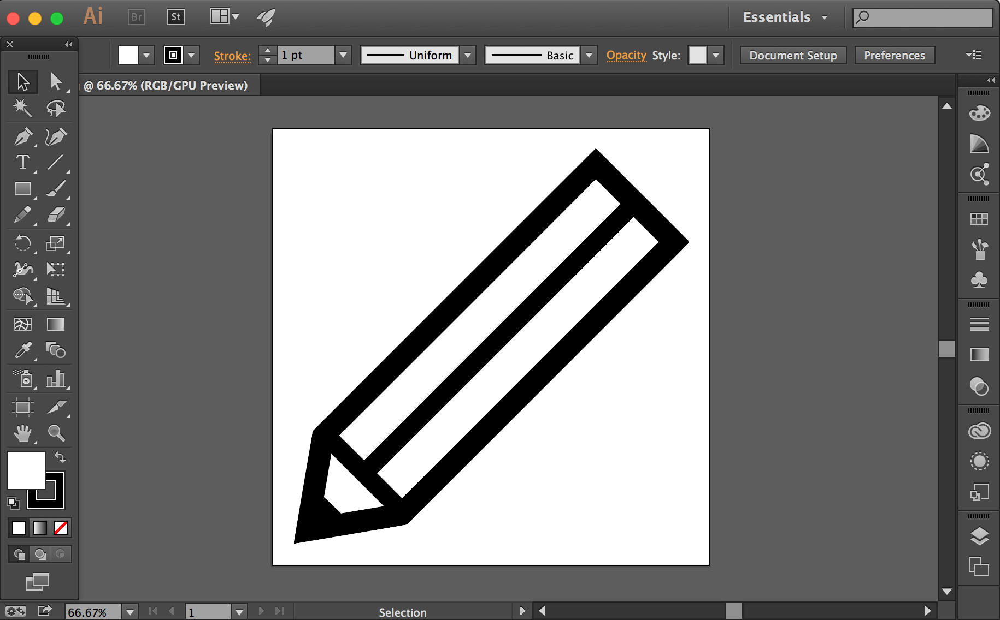
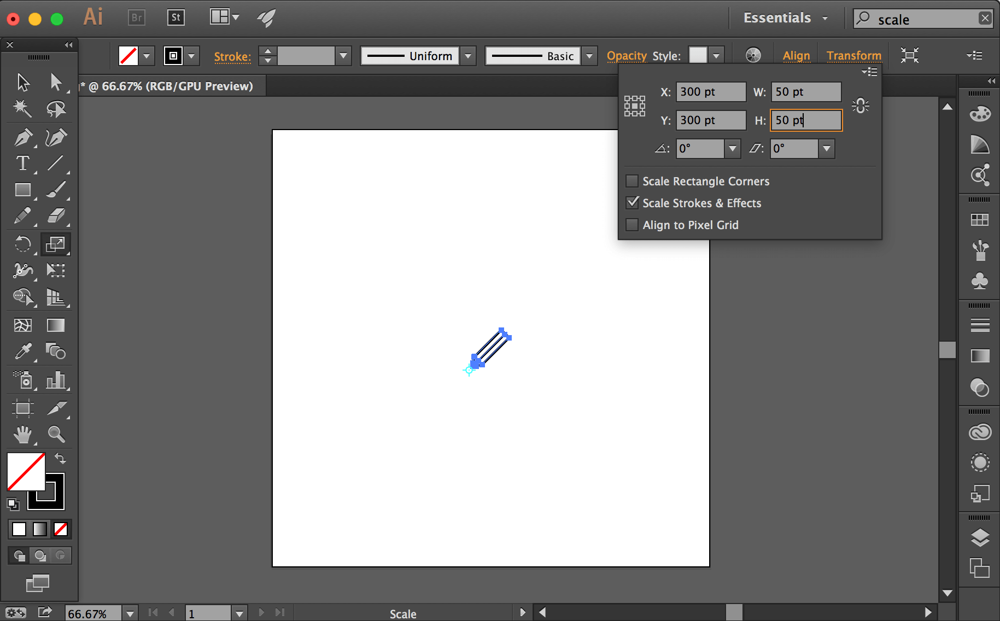
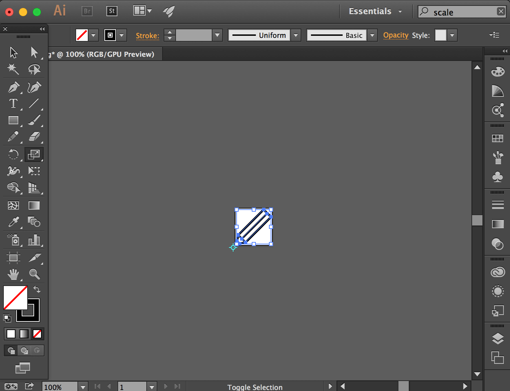
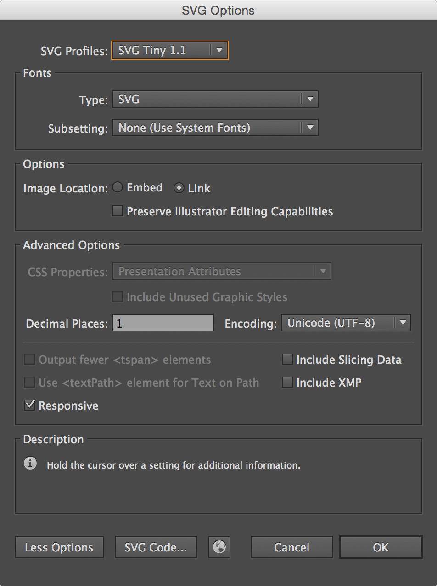
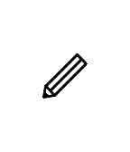

<!--
Modified from https://github.com/google/pebble

# Copyright 2025 Google LLC
#
# Licensed under the Apache License, Version 2.0 (the "License");
# you may not use this file except in compliance with the License.
# You may obtain a copy of the License at
#
#     http://www.apache.org/licenses/LICENSE-2.0
#
# Unless required by applicable law or agreed to in writing, software
# distributed under the License is distributed on an "AS IS" BASIS,
# WITHOUT WARRANTIES OR CONDITIONS OF ANY KIND, either express or implied.
# See the License for the specific language governing permissions and
# limitations under the License.
-->

# Converting SVG to PDC

Pebble Draw Commands or (`Draw Commands`) (PDC) are a powerful method of
creating vector images and icons that can be transformed and manipulated at
runtime. These can be used as a low-cost alternative to APNGs or bitmap
sequences. Currently the only simple way to create PDC files is to use the
[`svg2pdc.py`](https://github.com/pebble-examples/cards-example/blob/master/tools/svg2pdc.py)
tool. However, as noted in
[*Vector Animations*](/tutorials/advanced/vector-animations/#creating-compatible-files)
there are a some limitations to the nature of the input SVG file:

> The `svg2pdc` tool currently supports SVG files that use **only** the
> following elements: `g`, `layer`, `path`, `rect`, `polyline`, `polygon`,
> `line`, `circle`.

Fortunately, steps can be taken when creating SVG files in popular graphics
packages to avoid these limitations and ensure the output file is compatible
with `svg2pdc.py`. In this guide, we will be creating compatible PDC files using
an example SVG - this
[pencil icon](https://upload.wikimedia.org/wikipedia/commons/a/ac/Black_pencil.svg).

{: style="background-color:white;height:150px;width:150px"}

## Using Inkscape

- First, open the SVG in [Inkscape](https://inkscape.org/en/):



- Resize the viewport with *File*, *Document Properties*,
  *Page*, *Resize Page to Drawing*:

{: style="height:auto;width:400px"}

- Select the layer, then resize the image to fit Pebble (50 x 50 pixels in this
  example) with *Object*, *Transform*:


- Now that the image has been resized, shrink the viewport again with *File*,
  *Document Properties*, *Page*, *Resize Page to Drawing*:

- Remove groupings with *Edit*, *Select All*, then *Object*, *Ungroup* until no
  groups remain:



- Disable relative move in *Object*, *Transform*. Hit *Apply*:


- Finally, save the image as a 'Plain SVG':



## Using Illustrator

- First, open the SVG in Illustrator:



- Resize the image to fit Pebble (50 x 50 pixels in this example) by entering in
  the desired values in the 'W' and 'H' fields of the *Transform* panel:



- Ungroup all items with *Select*, *All*, followed by *Object*, *Ungroup* until
  no groups remain:


- Shrink the image bounds with *Object*, *Artboards*, *Fit to Selected Art*:



- Save the SVG using *File*, *Save As* with the *SVG Tiny 1.1* profile and 1 decimal places:



## Using the PDC Files

Once the compatible SVG files have been created, it's time to use `svg2pdc.py`
to convert into PDC resources, which will contain all the vector information
needed to draw the image in the correct Pebble binary format. The command is
shown below, with the Inkscape output SVG used as an example:

```bash
$ python svg2pdc.py pencil-inkscape.svg  # Use python 2.x!
```

> If a coordinate value's precision value isn't supported, a warning will be
> printed and the nearest compatible value will be used instead:
>
> ```text
> Invalid point: (9.4, 44.5). Closest supported coordinate: (9.5, 44.5)
> ```

To use the PDC file in a Pebble project, read
[*Drawing a PDC Image*](/tutorials/advanced/vector-animations/#drawing-a-pdc-image).
The result should look near-identical on Pebble:



## Example Output

For reference, compatible output files are listed below:

- Inkscape: [SVG](../../../assets/other/pdc/pencil-inkscape.svg) | [PDC](../../../assets/other/pdc/pencil-inkscape.pdc)

- Illustrator: [SVG](../../../assets/other/pdc/pencil-illustrator.svg) | [PDC](../../../assets/other/pdc/pencil-illustrator.pdc)
