<!--
Modified from https://github.com/google/pebble

# Copyright 2025 Google LLC
#
# Licensed under the Apache License, Version 2.0 (the "License");
# you may not use this file except in compliance with the License.
# You may obtain a copy of the License at
#
#     http://www.apache.org/licenses/LICENSE-2.0
#
# Unless required by applicable law or agreed to in writing, software
# distributed under the License is distributed on an "AS IS" BASIS,
# WITHOUT WARRANTIES OR CONDITIONS OF ANY KIND, either express or implied.
# See the License for the specific language governing permissions and
# limitations under the License.
-->

# System Fonts

The tables below show all the system font identifiers available in the Pebble
SDK, sorted by family. A sample of each is also shown.

## Available System Fonts

### Raster Gothic

| Available Font Keys | Preview |
|---------------------|---------|
| `FONT_KEY_GOTHIC_14` | 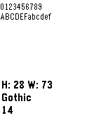 |
| `FONT_KEY_GOTHIC_14_BOLD` | 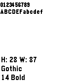 |
| `FONT_KEY_GOTHIC_18` | 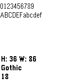 |
| `FONT_KEY_GOTHIC_18_BOLD` | 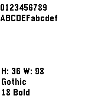 |
| `FONT_KEY_GOTHIC_24` | 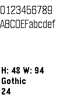 |
| `FONT_KEY_GOTHIC_24_BOLD` | 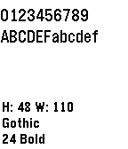 |
| `FONT_KEY_GOTHIC_28` | 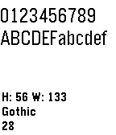 |
| `FONT_KEY_GOTHIC_28_BOLD` | 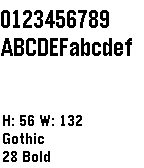 |

### Bitham

| Available Font Keys | Preview |
|---------------------|---------|
| `FONT_KEY_BITHAM_30_BLACK` | 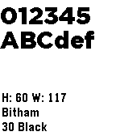 |
| `FONT_KEY_BITHAM_34_MEDIUM_NUMBERS` | 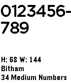 |
| `FONT_KEY_BITHAM_42_BOLD` | 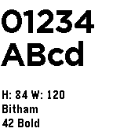 |
| `FONT_KEY_BITHAM_42_LIGHT` | 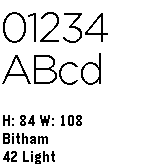 |
| `FONT_KEY_BITHAM_42_MEDIUM_NUMBERS` |  |

### Roboto/Droid Serif

| Available Font Keys | Preview |
|---------------------|---------|
| `FONT_KEY_ROBOTO_CONDENSED_21` | 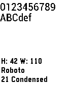 |
| `FONT_KEY_ROBOTO_BOLD_SUBSET_49` | 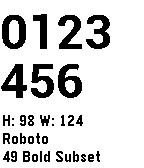 |
| `FONT_KEY_DROID_SERIF_28_BOLD` |  |

### LECO

| Available Font Keys | Preview |
|---------------------|---------|
| `FONT_KEY_LECO_20_BOLD_NUMBERS` |  |
| `FONT_KEY_LECO_26_BOLD_NUMBERS_AM_PM` | 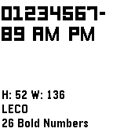 |
| `FONT_KEY_LECO_28_LIGHT_NUMBERS` |  |
| `FONT_KEY_LECO_32_BOLD_NUMBERS` | 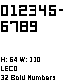 |
| `FONT_KEY_LECO_36_BOLD_NUMBERS` | 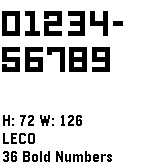 |
| `FONT_KEY_LECO_38_BOLD_NUMBERS` |  |
| `FONT_KEY_LECO_42_NUMBERS` | 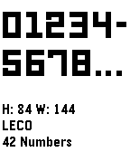 |

## Obtaining System Font Files

The following system fonts are available to developers in the SDK can be found
online for use in design mockups:

- [Raster Gothic](http://www.marksimonson.com/) - By Mark Simonson

- [Gotham (Bitham)](http://www.typography.com/fonts/gotham/overview/) -
  Available from Typography.com

- [Droid Serif](https://www.google.com/fonts/specimen/Droid+Serif) - Available
  from Google Fonts

- [LECO 1976](https://www.myfonts.com/fonts/carnoky/leco-1976/) - Available from
  Myfonts.com

## Using Emoji Fonts

A subset of the built-in system fonts support the use of a set of emoji
characters. These are the Gothic 24, Gothic 24 Bold, Gothic 18, and Gothic 18
Bold fonts, but do not include the full range.

To print an emoji on Pebble, specify the code in a character string like the one
shown below when using a `TextLayer`, or `graphics_draw_text()`:

```c
text_layer_set_text(s_layer, "Smiley face: \U0001F603");
```

An app containing a `TextLayer` displaying the above string will look similar
to this:


The supported characters are displayed below with their corresponding unicode
values.

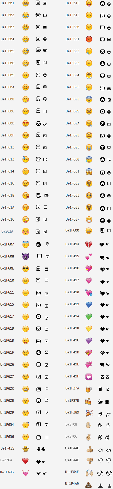

### Deprecated Emoji Symbols

The following emoji characters are no longer available on the Aplite platform.

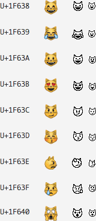
