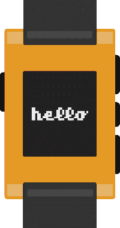

# Introduction

<!-- TODO: no centering available? -->

This page contains resources for first-timers who want to build something cool
with Pebble! Have a look at the tutorial series and the other links to get
started.

## Build a Watchface

Learn how to create your first watchface. This tutorial will cover basic Pebble
concepts, and is the recommended starting point for new developers.

[BUILD WITH JS](./js-watchface-tutorial/part1.md){ .md-button .md-button--primary } [BUILD WITH C](./watchface-tutorial/part1.md){ .md-button .md-button--primary }

## Build a One Click Action

Learn how to create your first one click action watchapp. This guide explains
how to create a watchapp that will makes a web request upon launch and display
the result.

[BUILD WITH C](#){ .md-button .md-button--primary }

## Learn C with Pebble

A community driven, open source textbook that teaches the fundamentals of C through the scope of Pebble application development.

[READ THE BOOK](#){ .md-button .md-button--primary }

## Publish Your App

Learn how to publish your watchface or watchapp on Pebble's appstore.

[PUBLISH AN APP](http://dev-portal.rebble.io/){ .md-button .md-button--primary }

## Go Beyond

If you're looking to take the next step with your Pebble development, we
encourage you to checkout the following resources:

- [Advanced Tutorials](<>)
- [Create and Publish a Pebble Packages](<>)
- [Integrate Pebble Packages into your project](<>)
- [Integrate with Pebble Health](<>)
- [Use Pebble Dictation Service](<>)
- [Create Configuration Pages](<>)
- [Build an Android Companion Apps](<>)
