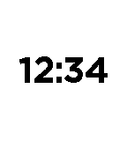
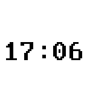
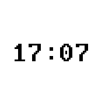

<!--
Modified from https://github.com/google/pebble

# Copyright 2025 Google LLC
#
# Licensed under the Apache License, Version 2.0 (the "License");
# you may not use this file except in compliance with the License.
# You may obtain a copy of the License at
#
#     http://www.apache.org/licenses/LICENSE-2.0
#
# Unless required by applicable law or agreed to in writing, software
# distributed under the License is distributed on an "AS IS" BASIS,
# WITHOUT WARRANTIES OR CONDITIONS OF ANY KIND, either express or implied.
# See the License for the specific language governing permissions and
# limitations under the License.
-->

# Customizing Your Watchface

In the previous page of the tutorial, you learned how to create a new Pebble
project, set it up as a basic watchface and use `TickTimerService` to display
the current time. However, the design was pretty basic, so let's improve it with
some customization!

In order to do this we will be using some new Pebble SDK concepts, including:

- Resource management
- Custom fonts (using `GFont`)
- Images (using `GBitmap` and `BitmapLayer`)

These will allow us to completely change the look and feel of the watchface. We
will provide some sample materials to use, but once you understand the process
be sure to replace these with your own to truly make it your own! Once we're
done, you should end up with a watchface looking like this:

| Aplite | Basalt | Chalk |
|--------|--------|-------|
|  |  |  |

## First Steps

To continue from the last part, you can either modify your existing Pebble
project or create a new one, using the code from that project's main `.c` file
as a starting template. For reference, that should look
[something like this](https://gist.github.com/pebble-gists/9b9d50b990d742a3ae34).

The result of the first part should look something like this - a basic time
display:

| Aplite | Basalt | Chalk |
|--------|--------|-------|
|  |  |  |

Let's improve it!

## Adding a Custom Font

App resources (fonts and images etc.) are managed in the `package.json`
file in the project's root directory, as detailed in
[*App Resources*](/guides/app-resources/). All image files and fonts must
reside in subfolders of the `/resources` folder of your project. Below is an
example entry in the `media` array:

```json
"media": [
  {
    "type": "font",
    "name": "FONT_PERFECT_DOS_48",
    "file": "fonts/perfect-dos-vga.ttf",
    "compatibility":"2.7"
  }
]
```

In the example above, we would place our `perfect-dos-vga.ttf` file in the
`/resources/fonts/` folder of our project.

A custom font file must be a
[TrueType](http://en.wikipedia.org/wiki/TrueType) font in the `.ttf` file format.
Here is an example font to use: [source](http://www.dafont.com/perfect-dos-vga-437.font).

Now we will substitute the system font used before (`FONT_KEY_BITHAM_42_BOLD`)
for our newly imported one.

To do this, we will declare a `GFont` globally.

```c
// Declare globally
static GFont s_time_font;
```

Next, we add the creation and substitution of the new `GFont` in the existing
call to `text_layer_set_font()` in `main_window_load()`. Shown here is an
example identifier used when uploading the font earlier, `FONT_PERFECT_DOS_48`,
which is always pre-fixed with `RESOURCE_ID_`:

```c
void main_window_load() {
  // ...
  // Create GFont
  s_time_font = fonts_load_custom_font(resource_get_handle(RESOURCE_ID_FONT_PERFECT_DOS_48));

  // Apply to TextLayer
  text_layer_set_font(s_time_layer, s_time_font);
  // ...
}
```

And finally, safe destruction of the `GFont` in `main_window_unload()`:

```c
void main_window_unload() {
  // ...
  // Unload GFont
  fonts_unload_custom_font(s_time_font);
  // ...
}
```

After re-compiling and re-installing with `pebble build && pebble install`,
the watchface should feature a much more interesting font.

An example screenshot is shown below:

| Aplite | Basalt | Chalk |
|--------|--------|-------|
|  |  |  |

## Adding a Bitmap

The Pebble SDK also allows you to use a 2-color (black and white) bitmap image
in your watchface project. You can ensure that you meet this requirement by
checking the export settings in your graphics package, or by purely using only
white (`#FFFFFF`) and black (`#000000`) in the image's creation. Another
alternative is to use a dithering tool such as
[HyperDither](http://2002-2010.tinrocket.com/software/hyperdither/index.html).
This will be loaded from the watchface's resources into a `GBitmap` data
structure before being displayed using a `BitmapLayer` element. These two
behave in a similar fashion to `GFont` and `TextLayer`, so let's get
started.

You add a bitmap to the `package.json` file in the
[same way](/guides/app-resources/fonts) as a font, except the new `media` array
object will have a `type` of `bitmap`. Below is an example:

```json
{
  "type": "bitmap",
  "name": "IMAGE_BACKGROUND",
  "file": "images/background.png"
}
```

As before, here is an example bitmap we have created for you to use, which looks
like this:


Once this has been added to the project, return to your `.c` file and declare
two more pointers, one each of `GBitmap` and `BitmapLayer` near the top of
the file:

```c
static BitmapLayer *s_background_layer;
static GBitmap *s_background_bitmap;
```

Now we will create both of these in `main_window_load()`. After both elements
are created, we set the `BitmapLayer` to use our `GBitmap` and then add it
as a child of the main `Window` as we did for the `TextLayer`.

However, is should be noted that the `BitmapLayer` must be added to the
`Window` before the `TextLayer`. This will ensure that the text is drawn *on
top of* the image. Otherwise, the text will be drawn behind the image and remain
invisible to us. Here is that process in full, to be as clear as possible:

```c
// Create GBitmap
s_background_bitmap = gbitmap_create_with_resource(RESOURCE_ID_IMAGE_BACKGROUND);

// Create BitmapLayer to display the GBitmap
s_background_layer = bitmap_layer_create(bounds);

// Set the bitmap onto the layer and add to the window
bitmap_layer_set_bitmap(s_background_layer, s_background_bitmap);
layer_add_child(window_layer, bitmap_layer_get_layer(s_background_layer));
```

As always, the final step should be to ensure we free up the memory consumed by
these new elements in `main_window_unload()`:

```c
// Destroy GBitmap
gbitmap_destroy(s_background_bitmap);

// Destroy BitmapLayer
bitmap_layer_destroy(s_background_layer);
```

The final step is to set the background color of the main `Window` to match
the background image. Do this in `init()`:

```c
window_set_background_color(s_main_window, GColorBlack);
```

With all this in place, the example background image should nicely frame the
time and match the style of the new custom font. Of course, if you have used
your own font and bitmap (highly recommended!) then your watchface will not look
exactly like this.

| Aplite | Basalt | Chalk |
|--------|--------|-------|
|  |  |  |

## Conclusion

After adding a custom font and a background image, our new watchface now looks
much nicer. If you want to go a bit further, try adding a new `TextLayer` in
the same way as the time display one to show the current date (hint: look at the
[formatting options](http://www.cplusplus.com/reference/ctime/strftime/)
available for `strftime()`!)

As with last time, you can compare your own code to the example source code
using the button below.

[View Source Code](https://gist.github.com/d216d9e0b840ed296539)

## What's Next?

The next section of the tutorial will introduce PebbleKit JS for adding
web-based content to your watchface.

[Go to Part 3](./part3.md)
